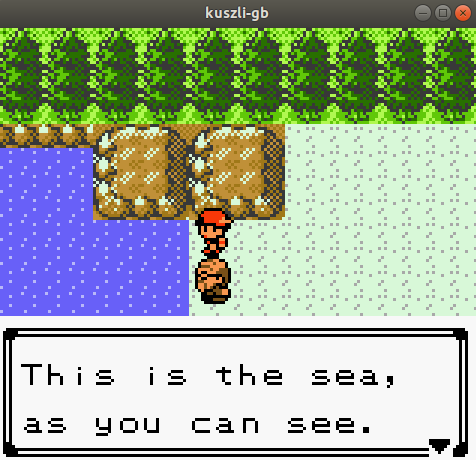
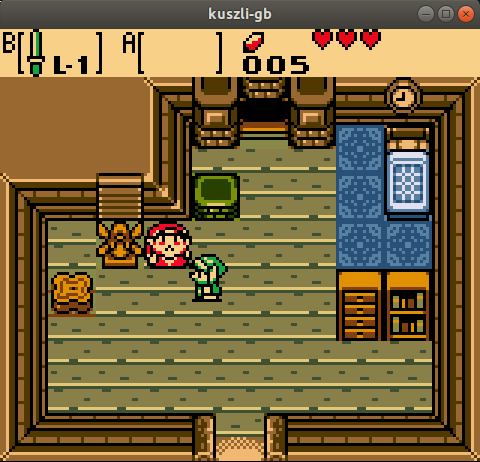
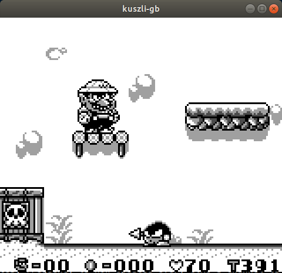
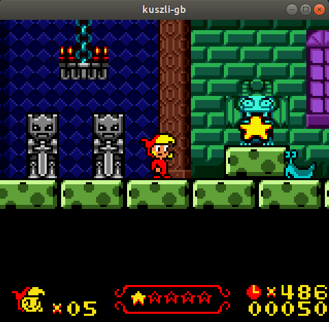

# kuszli-gb
Nintendo Gameboy and Gameboy Color emulator

## General info
kuszli-gb is written from scratch in C++ using C++11 standard. 
It utilizes SFML library for video and audio output and for keyboard input. 

## Usage
```
./kuszli-gb path/to/rom
```

## Controls
* **D-pad** - Arrows
* **A** - Z
* **B** - X
* **START** - Enter
* **SELECT** - Backspace

## Building 
To build kuszli-gb you need SFML 2.5.1 and CMake. On windows you need MinGW or VisualStudio.

* [SFML](https://www.sfml-dev.org/)
* [CMake](https://cmake.org/)

### Building procedure - linux
```
mkdir build
cd build
cmake .. -DSFML_DIR=path/to/sfml/root
make
```
### Building procedure - windows
#### MinGW
```
mkdir build
cd build
cmake .. -G "MinGW Makefiles" -DSFML_DIR=path/to/sfml/root
mingw32-make
```
When emulator is compiled, copy sfml dll's to folder where executable file is.
#### Visual Studio
Open Visual Studio in kuszli-gb root, go to cmake settings and set command line arguments to
`-DSFML_DIR=path/to/sfml/root`. Build executable file and copy sfml dll's to executable file folder.

## Screenshots






